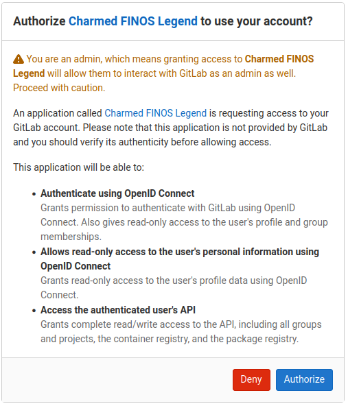
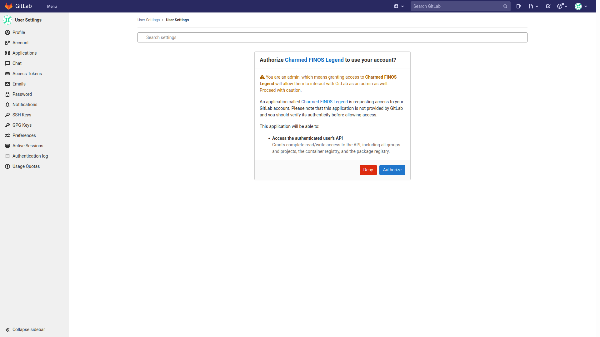
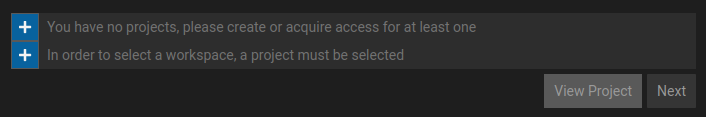

# Deploying FINOS Legend using Charmed Operators in your PC

## Overview

This tutorial will cover how to use Juju and Charmed Operators to deploy an instance of the [FINOS Legend](https://www.finos.org/legend) stack on Kubernetes. We will also show you how to integrate it with a self-hosted instance of Gitlab. Deploying and integrating FINOS legend using charmed operators is essentially a two step process as shown below, if you are already using a Juju controller for your Kubernetes cluster, and have a deployed Gitlab instance that is reachable from pods in your Kubernetes cluster.

```bash
$ juju deploy finos-legend-bundle

$ juju config finos-legend-gitlab-integrator-k8s gitlab-host=<GITLAB-URL-OR-IP> access-token=<ACCESS-TOKEN>
```

For the purposes of this tutorial we do not assume you already have such a Juju controller and Gitlab instance. Hence we will take you through all the steps to create a Kubernetes cluster and deploy a Gitlab instance on your laptop or PC workstation. Such a deployment may be used not only for evaluation or demonstration purposes but also as a development and test platform for FINOS Legend applications. These steps may be carried out on any Linux distribution that has a [Snap](https://snapcraft.io/) package manager installed. The steps in this tutorial have been tested on [Ubuntu 20.04](https://releases.ubuntu.com/focal/). Following the steps in this tutorial does require that your Linux host has a working Internet connection.

## Deploying Microk8s

Juju will bootstrap to most Kubernetes clusters (regardless of the vendor) and you can use your own for the rest of this tutorial. We shall use the [Microk8s](https://microk8s.io/) for the rest of this tutorial.

Install Microk8s using the command line:

```bash
sudo snap install microk8s --classic
```

Add an alias for `kubectl`:

```bash
snap alias microk8s.kubectl kubectl
```

Create a new shell session with active membership to the `microk8s` group. You can also achieve this by logging out, and logging back in again:

```bash
newgrp microk8s
```

Enable the `dns`, `storage` and `ingress` add-ons:

```bash
microk8s.enable dns storage ingress
```

The command above will take a few moment to complete. You can check the status with:

```bash
microk8s status --wait-ready
```

Ensure that the selected add-ons are enabled as shown below by checking the output of the status command shown above :

```bash
$ microk8s status --wait-ready
microk8s is running
high-availability: no
  datastore master nodes: 127.0.0.1:19001
  datastore standby nodes: none
addons:
  enabled:
    dns                  # CoreDNS
    ha-cluster           # Configure high availability on the current node
    ingress              # Ingress controller for external access
    storage              # Storage class; allocates storage from host directory
...
```

## Deploying Gitlab using Docker Compose

FINOS Legend charms can be used in conjunction with any private hosted Gitlab. Instructions on installing a self managed Gitlab are available from the [Gitlab site](https://docs.gitlab.com/). The following is an example of a docker-compose file that may be used to deploy Gitlab using a static IP address on your local machine.

An example of a `docker-compose.yml` file to deploy Gitlab is
``` yaml
version: '3.6'
services:
  gitlab:
    image: 'gitlab/gitlab-ee:latest'
    restart: always
    hostname: 'gitlab'
    domainname: 'gitlab.local'
    container_name: 'gitlab'
    environment:
      GITLAB_OMNIBUS_CONFIG: |
        external_url 'https://gitlab.local:443'
        gitlab_rails['initial_root_password'] = '${FINOS_GITLAB_PASSWORD:?no gitlab password set}'
        gitlab_rails['gitlab_shell_ssh_port'] = 2224
        gitlab_rails['lfs_enabled'] = true
        nginx['listen_port'] = 443
        nginx['ssl_certificate'] = '/etc/gitlab/ssl/gitlab.local.crt'
        nginx['ssl_certificate_key'] = '/etc/gitlab/ssl/gitlab.local.key'
        letsencrypt['enable'] = false
    ports:
      - '443:443'
      - '2224:2224'
    volumes:
      - '${GITLAB_HOME:?no gitlab home set}/config:/etc/gitlab'
      - '${GITLAB_HOME:?no gitlab home set}/logs:/var/log/gitlab'
      - '${GITLAB_HOME:?no gitlab home set}/data:/var/opt/gitlab'
      - './certs:/etc/gitlab/ssl'
    networks:
      legend:
        ipv4_address: 172.18.0.2
networks:
  legend:
    ipam:
      driver: default
      config:
        - subnet: 172.18.0.0/16

```

Prior to deploying Gitlab using this docker compose file two environment variables need to be set

1. `GITLAB_HOME` : This is the folder location under which Gitlab will
   store all its data.
   
2. `FINOS_GITLAB_PASSWORD` : This is the root password for Gitlab.

Also note that this docker compose file sets a static IP address (`172.18.0.2`) for Gitlab because the IP address is used in generating TLS certificates for Gitlab. This IP subnet and address, in the docker compose file, may be changed to suit your own deployment, if necessary. Generation of the TLS certificate can be done using a OpenSSL configuration file `cert.cnf` as shown below

``` 
[ req ]
default_bits                  = 2048
distinguished_name            = req_distinguished_name
req_extensions                = req_ext
[ req_distinguished_name ]
countryName                   = US
stateOrProvinceName           = NY
localityName                  = NY
organizationName              = XX
commonName                    = gitlab.local
[ req_ext ]
subjectAltName                = @alt_names
[alt_names]
DNS.1=gitlab.local
IP.1=172.18.0.2
```

Note that the OpenSSL config file uses the same IP and domain name as in the docker compose file to specify Subject Alternative Names. Using this config file a self-sigend TLS certificate may be generated using the following command line

```
$ mkdir certs
$ openssl req -newkey rsa:2048 -nodes -keyout "certs/gitlab.local.key" -x509 -days 365 -out "certs/gitlab.local.crt" \
	-config "cert.cnf" -extensions req_ext -subj "/C=US/ST=NY/L=NY/O=XX/CN=gitlab.local"
```

If your certificates were successfully generated you should see an ouput like this :

```bash
openssl req -newkey rsa:2048 -nodes -keyout "certs/gitlab.local.key" -x509 -days 365 -out "certs/gitlab.local.crt" \
	-config "cert.cnf" -extensions req_ext -subj "/C=US/ST=NY/L=NY/O=XX/CN=gitlab.local"
Generating a RSA private key
.............+++++
........+++++
writing new private key to 'certs/gitlab.local.key'
-----
openssl x509 -in "certs/gitlab.local.crt" -outform der -out "certs/gitlab.local.der"
```

Notice the generated self signed certificates are placed into the `certs` sub-directory.

Assuming the docker compose file (`docker-compose.yml`) show above is in your current directory and the certificates are in a sub-directory `certs` of the same directory, a Gitlab instance may be launched using the standard command line as in `docker-compose up -d`. Note that for a production deployment you may want to generate certificates using a valid certificate authority.

After exporting the environment variables and launching Gitlab using docker you may see output such as :

```bash
$ export GITLAB_HOME=~/gitlab
$ export FINOS_GITLAB_PASSWORD=mypassword
$ docker-compose up -d
Creating network "legend_legend" with the default driver
Creating gitlab ... done
```

It takes a while for Gitlab to start. You may monitor the status of Gitlab to see if it has started using the command `docker ps`.

If Gitlab is still in the process of starting you may see output such as :

```bash
$ docker ps
CONTAINER ID   IMAGE                     COMMAND             CREATED          STATUS                            PORTS                                                                                              NAMES
f3d3ac6ee794   gitlab/gitlab-ee:latest   "/assets/wrapper"   10 seconds ago   Up 9 seconds (health: starting)   22/tcp, 0.0.0.0:443->443/tcp, :::443->443/tcp, 80/tcp, 0.0.0.0:2224->2224/tcp, :::2224->2224/tcp   gitlab
```

Notice the `STATUS` is `health: starting`.

Once Gitlab has successfully started you will see ouput such as :

```bash
$ docker ps
CONTAINER ID   IMAGE                     COMMAND             CREATED         STATUS                   PORTS                                                                                              NAMES
f3d3ac6ee794   gitlab/gitlab-ee:latest   "/assets/wrapper"   4 minutes ago   Up 4 minutes (healthy)   22/tcp, 0.0.0.0:443->443/tcp, :::443->443/tcp, 80/tcp, 0.0.0.0:2224->2224/tcp, :::2224->2224/tcp   gitlab
```

Notice the `STATUS` is `healthy`.  Once Gitlab has started you may point your web browser to its local IP address, which is `172.18.0.2` in this tutorial, and you should see the Gitlab login screen. You may login using the password set by you in the `FINOS_GITLAB_PASSWORD` environment variable.

## Deploying Juju

You can follow [the instructions in the docs](https://juju.is/docs/olm/installing-juju) or simply install a Juju with the command line :

```bash
sudo snap install juju --classic
```

If you are *not* using Microk8s, you can [manually add the credentials](https://juju.is/docs/olm/clouds) to your cloud.

## Bootstrap Juju in your cluster

In Juju terms, "bootstrap" means "create a Juju controller", which is the part of Juju that runs in your cluster and controls the applications.

If you are following this tutorial with Microk8s, run

```bash
juju bootstrap microk8s finos-legend-controller
```

You are free to use any name other than `finos-legend-controller` but it must be consistent through the rest of this tutorial.

If you are not using Microk8 then to install the Juju controller in your cloud, simply run

```bash
juju bootstrap <cloud_name> <controller_name>
```

Choices for `<cloud_name>` can be found running `juju clouds`. Further details on deploying and using Juju in different clouds may be found in its [documentation](https://juju.is/docs).

Running `juju status` will now show the Juju Controller in your cloud.

## Create a Model

[Juju models](https://juju.is/docs/olm/models) are a logical grouping of applications and infrastructure that work together to deliver a service or product. In Kubernetes terms, models are effectively namespaces. Models are fundamental concepts in Juju and implement service isolation, access control, repeatability and boundaries.

You can add a new model with

```bash
juju add-model <model_name>
```

We will name our model `finos-legend`

``` bash
juju add-model finos-legend
```

## Deploy Legend

When you deploy an application with Juju, the installation code in the charmed operator will run and set up all the resources and environmental variables needed for the application to run properly. In the case of this tutorial, we are deploying a *bundle* -- which not only describes a set of applications we want deployed, but also the relations between them.

Deploy the [finos-legend-bundle](https://charmhub.io/finos-legend-bundle) in the `finos-legend` model using the command line :

```bash
juju deploy finos-legend-bundle
```

In another terminal window, you can see the applications being deployed and the integration code running

```bash
watch --color juju status --color
```

After a couple of minutes, you'll notice that your application status looks like this

```bash
Model  Controller  Cloud/Region        Version  SLA          Timestamp
lma    microk8s    microk8s/localhost  2.9.16   unsupported  14:14:06+01:00

App                                 Version  Status   Scale  Charm                               Store     Channel  Rev  OS          Address         Message
finos-legend-db-k8s                          active       1  finos-legend-db-k8s                 charmhub  edge      13  kubernetes  10.152.183.135
finos-legend-engine-k8s                      waiting      1  finos-legend-engine-k8s             charmhub  edge      13  kubernetes  10.152.183.11   installing agent
finos-legend-gitlab-integrator-k8s           waiting      1  finos-legend-gitlab-integrator-k8s  charmhub  edge      24  kubernetes  10.152.183.102  installing agent
finos-legend-sdlc-k8s                        waiting      1  finos-legend-sdlc-k8s               charmhub  edge      36  kubernetes  10.152.183.42   installing agent
finos-legend-studio-k8s                      waiting      1  finos-legend-studio-k8s             charmhub  edge      14  kubernetes  10.152.183.141  installing agent
mongodb-k8s                                  active       1  mongodb-k8s                         charmhub  edge       6  kubernetes  10.152.183.210

Unit                                   Workload  Agent  Address       Ports  Message
finos-legend-db-k8s/0*                 active    idle   10.1.252.83
finos-legend-engine-k8s/0*             waiting   idle   10.1.252.98          no legend gitlab info present in relation yet
finos-legend-gitlab-integrator-k8s/0*  blocked   idle   10.1.252.71          awaiting gitlab server configuration or relation
finos-legend-sdlc-k8s/0*               waiting   idle   10.1.252.122         no legend gitlab info present in relation yet
finos-legend-studio-k8s/0*             waiting   idle   10.1.252.78          no legend gitlab info present in relation yet
mongodb-k8s/0*                         active    idle   10.1.252.116
```

Notice the `blocked` status in red. This is perfectly normal, as the Legend stack is now waiting for you to pass the GitLab IP or URL and Access Token as a configuration parameter.

## Obtain a Gitlab Access Token

To obtain a Gitlab access token you will need application creation rights on a GitLab public or private instance. If you have deployed Gitlab locally as shown in this tutorial above you already have these rights since you are the Gitlab administrator.

To create the access token first log into Gitlab and browse to "User Settings" > "Access Tokens". You should see a web form as shown below


Fill in following details the form similar to that shown above:

- *Name:* "Legend Demo"
- *Scopes:* api
- *Expiration date:* Select any date in the future

Now click `Create access token` button and obtain your access token from the `Your new access token` textbox. **Save this Access Token for later use**

## Configure Gitlab endpoint

The Gitlab endpoint may be configured using the command line

```bash
$ juju config finos-legend-gitlab-integrator-k8s gitlab-host=<GITLAB-URL-OR-IP> access-token=<ACCESS-TOKEN>
```
In the above command line replace `<GITLAB-URL-OR-IP>` with the appropirate value. If you deployed Gitlab using the instructions in this tutorial this value is `172.18.0.2`. Also replace `<ACCESS-TOKEN>` with the appropriate value which you obtained from the previous step.

Run `juju status` to see the applications reacting to this configuration change. As a result of this change your FINOS Legend deployment should be complete shortly and the status command will show you output that should look like :

```bash
Model  Controller  Cloud/Region        Version  SLA          Timestamp
lma    microk8s    microk8s/localhost  2.9.16   unsupported  14:19:18+01:00

App                                 Version  Status  Scale  Charm                               Store     Channel  Rev  OS          Address         Message
finos-legend-db-k8s                          active      1  finos-legend-db-k8s                 charmhub  edge      13  kubernetes  10.152.183.135
finos-legend-engine-k8s                      active      1  finos-legend-engine-k8s             charmhub  edge      13  kubernetes  10.152.183.11
finos-legend-gitlab-integrator-k8s           active      1  finos-legend-gitlab-integrator-k8s  charmhub  edge      24  kubernetes  10.152.183.102
finos-legend-sdlc-k8s                        active      1  finos-legend-sdlc-k8s               charmhub  edge      36  kubernetes  10.152.183.42
finos-legend-studio-k8s                      active      1  finos-legend-studio-k8s             charmhub  edge      14  kubernetes  10.152.183.141
mongodb-k8s                                  active      1  mongodb-k8s                         charmhub  edge       6  kubernetes  10.152.183.210

Unit                                   Workload  Agent  Address       Ports  Message
finos-legend-db-k8s/0*                 active    idle   10.1.252.83
finos-legend-engine-k8s/0*             active    idle   10.1.252.98
finos-legend-gitlab-integrator-k8s/0*  active    idle   10.1.252.71
finos-legend-sdlc-k8s/0*               active    idle   10.1.252.122
finos-legend-studio-k8s/0*             active    idle   10.1.252.78
mongodb-k8s/0*                         active    idle   10.1.252.116
```

Notice all `Workload`s and `Status`s are `active`. Once all the applications have become active, you can go to [Authorise the user and application](#authorise-the-legend-application-to-use-gitlab).

## Authorise the Legend application to use Gitlab

Get the IP address of the pod where Legend Studio using the `juju status` command. The output of the status command has two sections `App` and `Unit`. The IP address may taken from the column `Address` in the row starting with `finos-legend-studio-k8s/0*`.

Point your web browser to `<STUDIO-IP>:8080` replacing `<STUDIO-IP>` with the IP address you just found. Your browser should be automatically be redirected to a screen such as the one shown below :



Now authorise the GitLab application to talk to Studio by clicking the `Authorize` button.

You may now access the Legend Studio application by again pointing your browser to `<STUDIO-IP>:8080`. You should now see a web page that looks like the one shown below :


Notice the `Unauthorized` pop-up dialog box in the lower right corner. This is normal. Even though you have authorized the Legend application to access your Gitlab instance, you have not yet authorized yourself to access the Legend application! So [Authorise yourself to use Legend](#authorise-the-user-to-use-legend) now.

## Authorise the user to use Legend

Once again look at the output of the `juju staus` command and identify the IP address of the Legend SDLC pod. This IP address may be obtained from the `Unit` section under `Address` in the row starting with `finos-legend-sdlc-k8s/0*`.  Use this IP address to replace `<SDLC-IP>` in the URL `<SDLC-IP>:7070/api/auth/authorize` and point your web browser to it. You browser should automatically be redirected to another authorisation screen as shown below :



Click the `Authorize` button and you should shortly see a `Success` status message in your web browser.

Finally, you should now be able to access the Legend Studio dashboard at `<STUDIO-IP>:8080/studio`. If you followed all the steps in tutorial exactly as described this dashboard should appear as shown below :



## Cleaning up

We hope this tutorial helped you evaluate, test or demo the FINOS Legend application with the convenience of Juju. Now if you would like to remove all deployed Legend applications, remove any data and reset Juju to the state it was before Legend was deployed, you can destroy the controller (created during the bootstrapping process). **This is a very destructive operation - all your data created in studio will be lost!**

Destroy the Juju controller by running the following command after replacing `<controller-name>` by the name your choose above.

```bash
juju destroy-controller -y --destroy-all-models --destroy-storage <controller-name>
```

## Remove Juju and MicroK8s

You can remove Juju, MicroK8s and any data associated with these snap's by running
``` bash
sudo snap remove juju --purge
sudo snap remove microk8s --purge
```

## A Recapitulation

* The steps required to deploy FINOS Legend using Charmed Operators are
  - If required Bootstrap Juju controller to your cluster
  - Preferably create a Model
  - Deploy `finos-legend-bundle`
  - Configure access to any Gitlab instance

## Other use cases
* This tutorial only covered deployment of FINOS Legend charmed operators on a host PC along with a locally deployed Gitlab instance. However these charms can be deployed on any cloud and should be able to use any Gitlab instance with requisite permissions.
* In this tutorial the Legend applications stack was deployed as a *bundle* in the same cloud. [Juju](https://juju.is/) allows, however, for you to deploy each application on a different cloud and then integrate the stack across your estate.
* In this tutorial we assumed your deployment host had a functioning Internet connection. However it is also possible to [deploy charmed operators offline](https://juju.is/docs/olm/working-offline).
* For use cases other than those discussed in this tutorial, you are welcome to reach out to the authors of these charmed operators through our [Help and Support](#help-and-support) forums.

## Help and Support

* Should you have any problems reproducing these instructions you may reach out to us for help and support through one of following two forums
  - [Canonical Mattermost Forum](https://chat.charmhub.io/charmhub/channels/charmed-legend). Authors of the charmed operators discussed in this tutorial should be reachable here.
  - [FINOS Legend Slack Channel](finos-lf.slack.com). FINOS developers should be reachable here.
